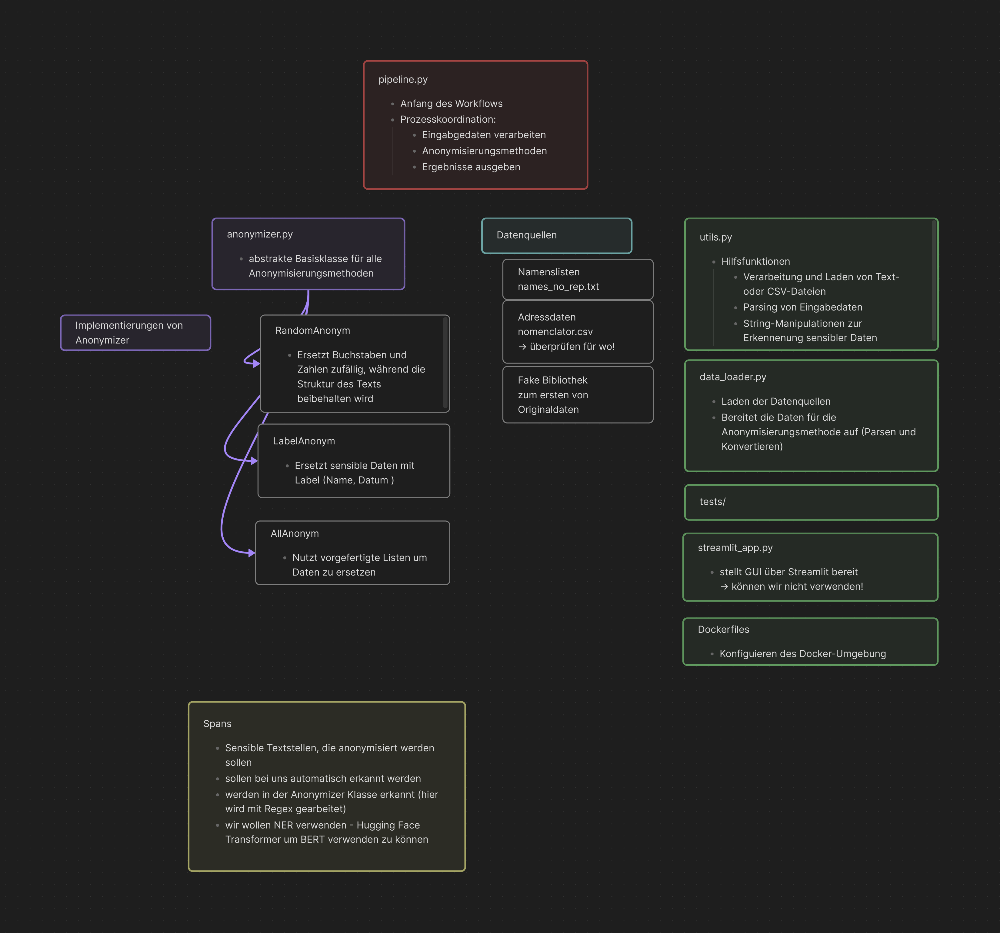

# Pipeline zum Anonymisieren 

Die Anonymisierungs-Pipeline dient dazu, sensible Daten in Texten zu erkennen und anonymisiert durch generierte, markierte oder maskierte Inhalte zu ersetzen.

## Overview der Vorlage

## Vorgehen 

1. Eingabedaten einlesen
- Text mit ggf. sensiblen Infos wird übergeben
- Nutzer kann wählen zwischen Modellen z.B. Spacy, HuggingFace NER-Modelle
- zusätzlich noch Regular Expressions verwendet
2. Modelle laden
- ausgewählte Modelle werden geladen
3. TrueCaser
- Groß/Kleinschreibung wird normalisiert
4. Sensible Daten identifizieren
- welche Daten? Namen, Adresse, E-Mail, Telefonnummer, Identifikationsnummern, Ortsangaben, Bankinformationen, Geburtsdaten
- Text wird durch die Pipeline verarbeitet
- NER-Modelle: finden die Daten basierend auf maschinellem Lernen
- Regex-Identifier: sucht nach vordefinierten Mustern, z.B. Telefonnummern  die sensiblen Daten werden markiert mit dem ausgewählten und geladenen Modell
5. Anonymisierung
- optional
- verschiedene Methoden möglich:
- Label: Sensible Daten werden durch das entsprechende Label ersetzt
- Random: Sensible Daten werden durch zufällige, aber plausible Daten ersetzt
- Intelligent: Sensible Daten werden mit anderen Kontextinformationen ersetzt, um den Text natürlich aussehen zu lassen
6. Ergebnis speichern
- der verarbeitete Text wird in der Ausgabedatei gespeichert

## Dependencies

pip install transformers pandas faker babel

